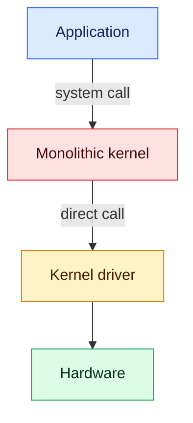
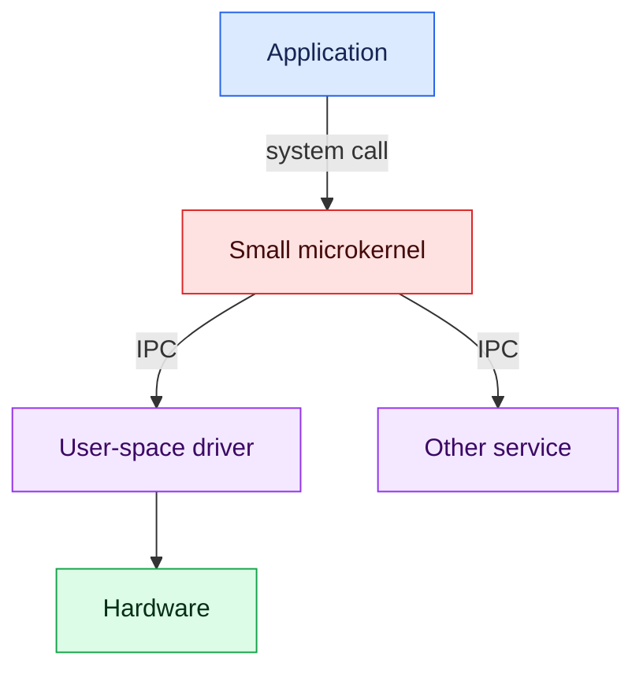
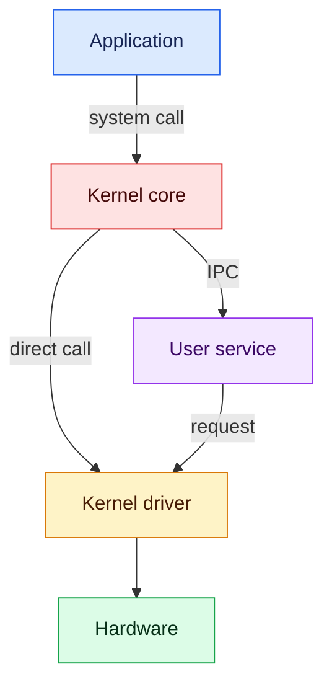

# Kernel architecture comparison

This project studies how driver failures behave in monolithic, microkernel, and
hybrid operating systems. Only the monolithic Linux example is implemented.
The other two designs describe the next stages of the project.

| Design | Driver location | Communication | Possible result of a driver fault |
|---|---|---|---|
| Monolithic | Kernel space | Direct calls | Kernel fault can stop the current task and destabilize the system |
| Microkernel | Usually a user process | IPC messages | Driver process can often be restarted |
| Hybrid | Kernel space or user space | Direct calls and IPC | Result depends on the failed component |

## Architecture diagrams

### Monolithic



The driver shares the kernel address space. A driver fault happens with kernel
privileges. Linux may stop the task that triggered the fault and continue, but
the kernel is no longer guaranteed to be in a safe state.

### Microkernel



The driver has a separate user-space address space. The system can often stop
and restart that driver without stopping the microkernel.

### Hybrid



A hybrid system keeps some components in the kernel and others in user space.
The failure boundary depends on where the faulty component runs.

## What the Linux example tests

The file `monolithic/kernel_module/memory_driver.c` is a real kernel module.
It asks `kmalloc` for one physically contiguous memory block.

The module has two parameters:

- `memory_mb`: requested memory in MiB.
- `unsafe_on_failure`: when set to `1`, deliberately writes through `NULL`
  after a failed allocation. This is allowed only when a hypervisor is detected.

The correct code checks whether `kmalloc` returned `NULL` and returns `-ENOMEM`.
The unsafe path demonstrates what can happen when driver code ignores that
error.

## Complete setup from a new VM

### 1. Download Lubuntu and create the VM

Install VirtualBox and download the **64-bit PC (AMD64) desktop image** from the
[official Lubuntu 24.04 LTS download page](https://download.cdimage.ubuntu.com/lubuntu/releases/24.04/release/).
Choose `lubuntu-24.04.4-desktop-amd64.iso`, not the torrent, manifest, or server
image.

From this `comparison` directory, run:

```bash
./scripts/create_lubuntu_vm.sh ~/Downloads/lubuntu-24.04.4-desktop-amd64.iso
```

The script creates `Kernel-Monolithic-Lab`, gives it 4 GiB of RAM and two CPUs,
registers this project as a permanent read-only shared folder, and opens the VM.

The error `Could not find a registered machine named Kernel-Monolithic-Lab`
means a shared-folder command was run before the VM was created. Run the
creation script first.

### 2. Install Lubuntu

In the VirtualBox window:

1. Select **Try or Install Lubuntu**.
2. Open **Install Lubuntu**.
3. Choose **Erase disk**. This erases only the VM's virtual disk.
4. Finish the installation and restart Lubuntu.

### 3. Install Guest Additions support in Lubuntu

Open a terminal with `Ctrl+Alt+T` and run:

```bash
sudo apt update
sudo apt install -y virtualbox-guest-utils virtualbox-guest-x11
sudo usermod -aG vboxsf "$USER"
sudo reboot
```

In the VM menu, enable **Devices > Shared Clipboard > Bidirectional**. In a
Linux terminal, paste with `Ctrl+Shift+V`.

The shared folder should appear at:

```text
/media/sf_kernel-comparison
```

If it does not appear, mount the registered share:

```bash
sudo mkdir -p /mnt/kernel-comparison
sudo mount -t vboxsf -o ro kernel-comparison /mnt/kernel-comparison
```

`No such file or directory` from `mount.vboxsf` means VirtualBox does not have a
share named `kernel-comparison`. Shut down the VM and, from this directory on
the host, register it using the current project path:

```bash
VBoxManage sharedfolder add Kernel-Monolithic-Lab \
  --name kernel-comparison \
  --hostpath "$PWD" \
  --readonly --automount
```

Then restart the VM. The creation script normally performs this step already.

### 4. Copy and compile the module in Lubuntu

```bash
cd ~
rm -rf ~/memory-driver
sudo cp -r /media/sf_kernel-comparison/monolithic/kernel_module ~/memory-driver
sudo chown -R "$USER:$USER" ~/memory-driver
cd ~/memory-driver
sudo apt install -y linux-headers-$(uname -r) build-essential
make
```

| Command | Meaning |
|---|---|
| `chown ...` | Gives the logged-in user ownership of the copy |
| `linux-headers-$(uname -r)` | Installs headers matching the running kernel |
| `build-essential` | Installs the compiler and build tools |
| `make` | Builds `memory_driver.ko` using the kernel build system |

## Test 1: normal driver operation

```bash
sudo insmod ./memory_driver.ko memory_mb=1
sudo dmesg | tail -n 10
sudo rmmod memory_driver
```

| Command | Meaning |
|---|---|
| `insmod` | Loads the `.ko` file into the running kernel |
| `memory_mb=1` | Requests 1 MiB through the module parameter |
| `dmesg` | Reads messages written to the kernel log |
| `tail -n 10` | Shows only the newest ten log lines |
| `rmmod` | Frees the buffer and unloads the module |

The expected log says that 1 MiB was requested, allocated, and initialized.

## Check the configured `kmalloc` ceiling

The module logs the kernel's `KMALLOC_MAX_SIZE` whenever it loads. After Test 1,
display it with one command:

```bash
sudo dmesg | grep 'kernel kmalloc ceiling' | tail -n 1
```

This is the compile-time ceiling for one `kmalloc` request. It is not the total
memory available to a driver. A smaller allocation can still fail when a large
enough contiguous block is unavailable.

In the observed VM, a request of 5 MiB failed. The module uses
`__GFP_NORETRY`, which asks Linux to return failure without aggressive memory
recovery. Test the safe failure with:

```bash
sudo insmod ./memory_driver.ko memory_mb=5
sudo dmesg | tail -n 10
```

The expected result is `Cannot allocate memory`, and the log should say
`failure handled safely with -ENOMEM`.

## Test 2: faulty driver access

Run the VM-only unsafe test:

```bash
sudo insmod ./memory_driver.ko memory_mb=5 unsafe_on_failure=1
```

The allocation fails, the teaching code writes through `NULL`, and the CPU
raises a kernel fault. Linux records a kernel oops. The `insmod` command may be
shown as `Killed` because module initialization was executing in that task's
system-call context. The driver is not a separate user process.

Linux may continue after this oops, but the kernel is tainted and its state is
not guaranteed to be safe. In our test, Linux killed the current `insmod` task
and the rest of the guest continued running. The module checks the CPU
hypervisor flag before unsafe mode. If no virtual machine is detected, it
returns `Operation not permitted`.

## Code-reading experiment: removing the safety check

The safe branch in `memory_driver.c` is:

```c
if (!unsafe_on_failure) {
    pr_info("memory_driver: failure handled safely with -ENOMEM\n");
    return -ENOMEM;
}
```

Commenting out this branch makes a failed allocation continue toward the
invalid access. Linux may kill the current `insmod` task and continue after the
oops. The supported and clearer test is to leave the code unchanged and pass
`unsafe_on_failure=1`.

## Common messages

- `Cannot allocate memory`: the module returned `-ENOMEM` safely.
- `Killed`: the current `insmod` task was terminated; inspect `dmesg` to learn
  whether this was an oops or an OOM event.
- `File exists`: the module is already loaded; run `sudo rmmod memory_driver`.
- `module verification failed`: the module is unsigned; Linux marks the test
  kernel tainted but can still load it.
- `Skipping BTF generation`: optional debugging information was unavailable.
- `vboxsf: Unknown parameter 'tag'`: Guest Additions and VirtualBox have
  different versions; it is unrelated to this module.

## Project status

The monolithic Linux test is the only implemented example. Future work will
create equivalent microkernel and hybrid tests so the same fault can be
compared across different isolation boundaries.

## License and attribution

This project is available under the MIT License. You may use, copy, modify, and
distribute it, including for commercial work. Copies or substantial portions
must keep the copyright and license notice so that credit remains with Hassan
Roumani and the original repository. See the repository [LICENSE](../LICENSE).

```text
comparison/
├── README.md
├── monolithic/kernel_module/
│   ├── Makefile
│   ├── memory_driver.c
│   └── README.md
└── scripts/create_lubuntu_vm.sh
```
