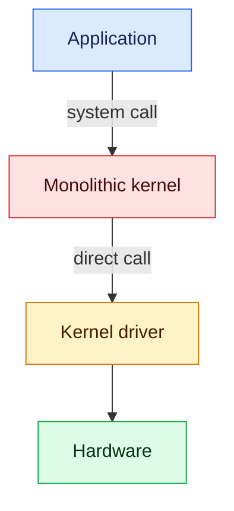
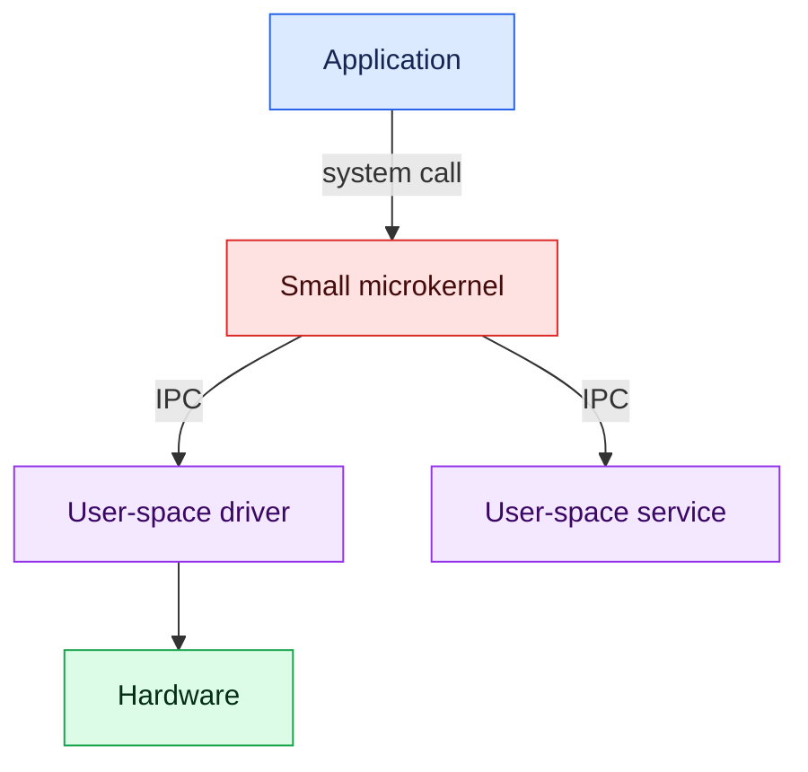
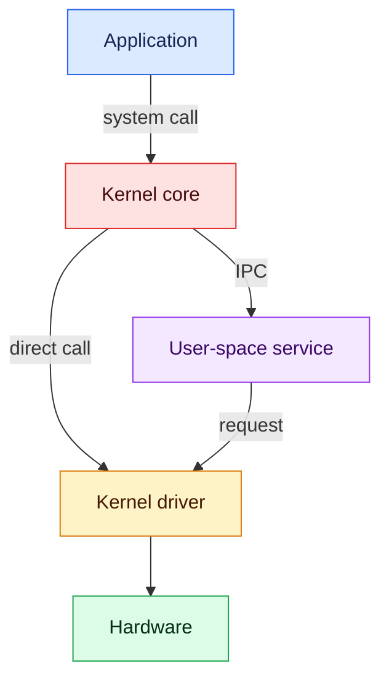

# Kernel architecture comparison

This study compares monolithic, microkernel, and hybrid operating-system
designs. It focuses on where system components run, how they communicate, and
what may happen when a driver fails.

| Design | Driver location | Communication | Failure isolation |
|---|---|---|---|
| Monolithic | Usually kernel space | Direct function calls | A serious driver fault can affect the kernel |
| Microkernel | Usually a user-space process | IPC messages | A failed driver can often be restarted separately |
| Hybrid | Kernel space and user space | Direct calls and IPC | The result depends on the component location |

## Monolithic architecture

A monolithic driver shares the kernel execution environment. Linux can recover
from some driver errors, but severe faults can leave the kernel damaged or stop
the complete operating system.

## Microkernel architecture

A microkernel keeps many services in separate user-space processes. The system
can often stop and restart a failed service without stopping the microkernel.
This isolation requires additional IPC communication.

## Hybrid architecture

A hybrid design keeps some components in the kernel and others in user space.
Its performance and failure isolation depend on where each component runs.

## Implemented studies

Only the Linux monolithic section currently contains executable examples. See
[`monolithic/README.md`](monolithic/README.md) for the environment and the list
of experiments.

Microkernel and hybrid implementations will be added as the study develops.

## License

This project is available under the repository [MIT License](../LICENSE).
