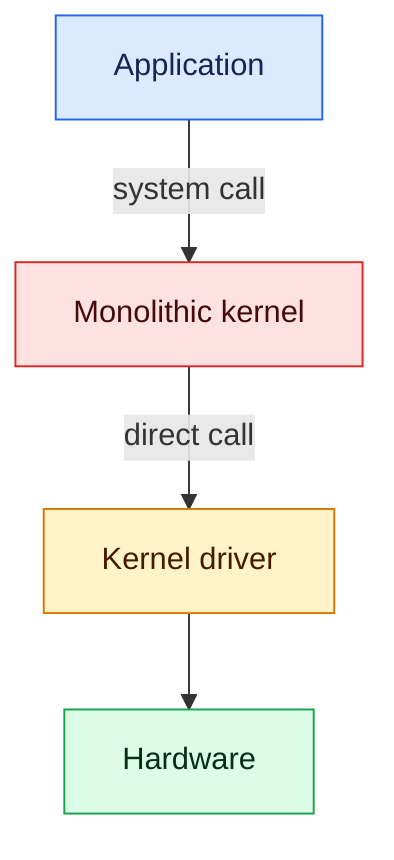
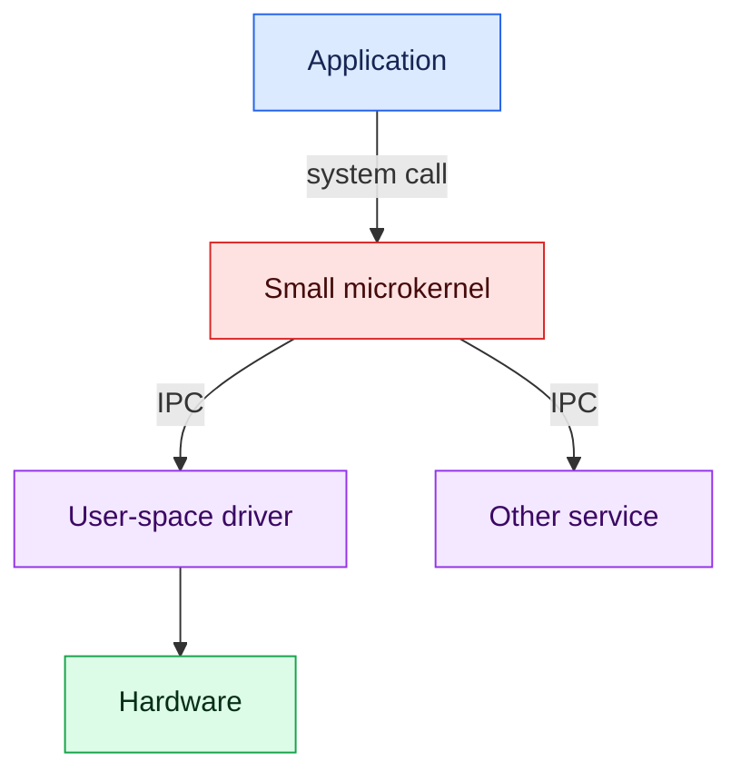
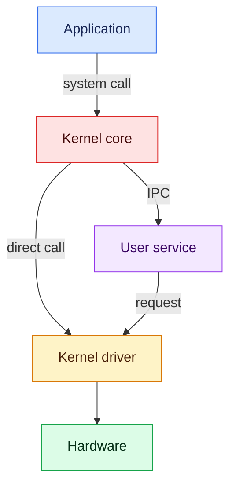

# Kernel architecture comparison

This project studies how driver failures behave in monolithic, microkernel, and
hybrid operating systems. Only the monolithic Linux example is implemented.
The other two designs describe the next stages of the project.

| Design | Driver location | Communication | Possible result of a driver fault |
|---|---|---|---|
| Monolithic | Kernel space | Direct calls | Kernel fault can stop the current task and destabilize the system |
| Microkernel | Usually a user process | IPC messages | Driver process can often be restarted |
| Hybrid | Kernel space or user space | Direct calls and IPC | Result depends on the failed component |

## Architecture diagrams

### Monolithic



The driver shares the kernel address space. A driver fault happens with kernel
privileges. Linux may stop the task that triggered the fault and continue, but
the kernel is no longer guaranteed to be in a safe state.

### Microkernel



The driver has a separate user-space address space. The system can often stop
and restart that driver without stopping the microkernel.

### Hybrid



A hybrid system keeps some components in the kernel and others in user space.
The failure boundary depends on where the faulty component runs.

## Current monolithic examples

This study now keeps only two small modules. They are separated so each file
has one clear purpose.

| Folder | Purpose | Expected result |
|---|---|---|
| `kernel_module_safe/` | Allocate and release one page correctly | Linux continues normally |
| `kernel_module_unsafe/` | Use the invalid result of a failed 5 MiB allocation | A kernel oops occurs |

The unsafe module is intentionally destructive. It checks the CPU hypervisor
flag and refuses to run when no virtual machine is detected. This safety check
does not replace a VM snapshot.

## Create the test VM

Download the **64-bit PC (AMD64) desktop image** from the
[official Lubuntu 24.04 LTS page](https://download.cdimage.ubuntu.com/lubuntu/releases/24.04/release/).
Choose `lubuntu-24.04.4-desktop-amd64.iso`.

From the `comparison` folder on the Linux host:

```bash
./scripts/create_lubuntu_vm.sh ~/Downloads/lubuntu-24.04.4-desktop-amd64.iso
```

The script creates the VM and registers the current `comparison` folder as the
read-only shared folder `kernel-comparison`. If the VM already exists, first
shut it down completely. Then run these commands from the `comparison` folder
on the host (Ensure VM is powered off):

```bash
VBoxManage list vms
VBoxManage sharedfolder remove "Kernel-Monolithic-Lab" --name kernel-comparison 2>/dev/null || true
VBoxManage sharedfolder add "Kernel-Monolithic-Lab" --name kernel-comparison --hostpath "$PWD" --readonly --automount
```

`VBoxManage list vms` shows the exact VM name. Replace
`Kernel-Monolithic-Lab` in the next two commands if your VM has a different
name. VirtualBox cannot change a permanent shared folder while the VM is
running or saved.

In VirtualBox, install Lubuntu on the VM's virtual disk. After installation,
open a Lubuntu terminal and install shared-folder support:

```bash
sudo apt update
sudo apt install -y virtualbox-guest-utils virtualbox-guest-x11
sudo usermod -aG vboxsf "$USER"
sudo reboot
```

After the reboot, the project should appear automatically inside the VM at:

```text
/media/sf_kernel-comparison
```

Check it with:

```bash
ls /media/sf_kernel-comparison
```

If that folder is missing, mount the share manually inside the VM:

```bash
sudo mkdir -p /mnt/kernel-comparison
sudo mount -t vboxsf kernel-comparison /mnt/kernel-comparison
ls /mnt/kernel-comparison
```

For the remaining commands, replace `/media/sf_kernel-comparison` with
`/mnt/kernel-comparison` if you used the manual mount.

The shared folder is read-only, but compilation creates new files. Install the
compiler and kernel headers, then copy the module folders into the VM user's
home directory:

```bash
sudo apt update
sudo apt install -y build-essential linux-headers-$(uname -r)
rm -rf ~/kernel-modules
mkdir -p ~/kernel-modules
cp -r /media/sf_kernel-comparison/monolithic/kernel_module_safe ~/kernel-modules/
cp -r /media/sf_kernel-comparison/monolithic/kernel_module_unsafe ~/kernel-modules/
```

The copies under `~/kernel-modules` are writable. You can compile and modify
them directly inside the VM without remounting the shared folder.

## Safe module

The complete code is in
`monolithic/kernel_module_safe/safe_driver.c`. Its main logic is:

```c
buffer = kmalloc(PAGE_SIZE, GFP_KERNEL);
if (!buffer)
    return -ENOMEM;
```

It asks for one page and checks the result. Build and run it inside the VM:

```bash
cd ~/kernel-modules/kernel_module_safe
make
sudo insmod ./safe_driver.ko
sudo dmesg | tail -n 5
sudo rmmod safe_driver
```

- `make` builds the loadable module.
- `insmod` loads it into the running kernel.
- `dmesg` shows the messages written by the module.
- `rmmod` unloads it and releases the allocated page.

## Unsafe module

The complete code is in
`monolithic/kernel_module_unsafe/unsafe_driver.c`. Its main logic is:

```c
if (!boot_cpu_has(X86_FEATURE_HYPERVISOR))
    return -EPERM;

memory = kmalloc(5 * 1024 * 1024, GFP_KERNEL);
memset(memory, 0, 5 * 1024 * 1024);
```

Take a VirtualBox snapshot before running it. Then build and load it inside the
disposable VM:

```bash
cd ~/kernel-modules/kernel_module_unsafe
make
sudo insmod ./unsafe_driver.ko
```

On the system used for this study, the 5 MiB request fails and `kmalloc()`
returns `NULL`. A correct driver would stop and return `-ENOMEM`. This module
continues and uses the invalid pointer. This causes a kernel fault while
`insmod` is loading the module, so Linux kills the `insmod` process.

The VM normally remains running. The example shows why a driver must always
check whether a memory allocation succeeded before using the memory.

## Project structure

```text
comparison/
├── README.md
├── monolithic/
│   ├── kernel_module_safe/
│   │   ├── Makefile
│   │   ├── README.md
│   │   └── safe_driver.c
│   └── kernel_module_unsafe/
│       ├── Makefile
│       ├── README.md
│       └── unsafe_driver.c
└── scripts/
    └── create_lubuntu_vm.sh
```

## License

This project is available under the repository [MIT License](../LICENSE).
